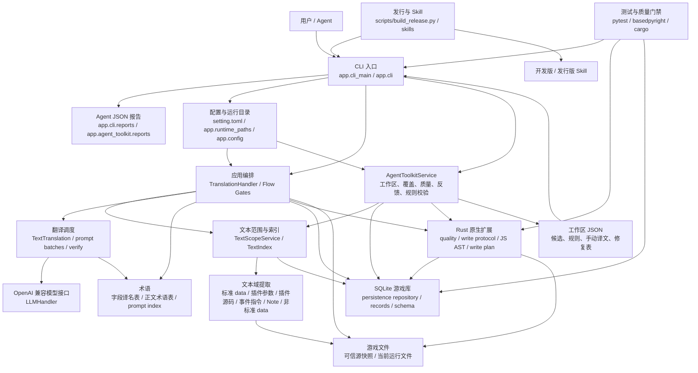
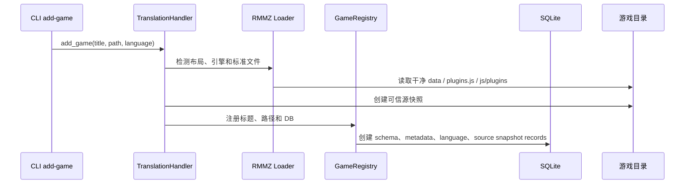
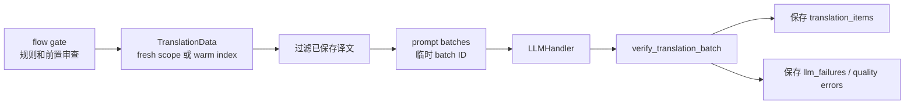
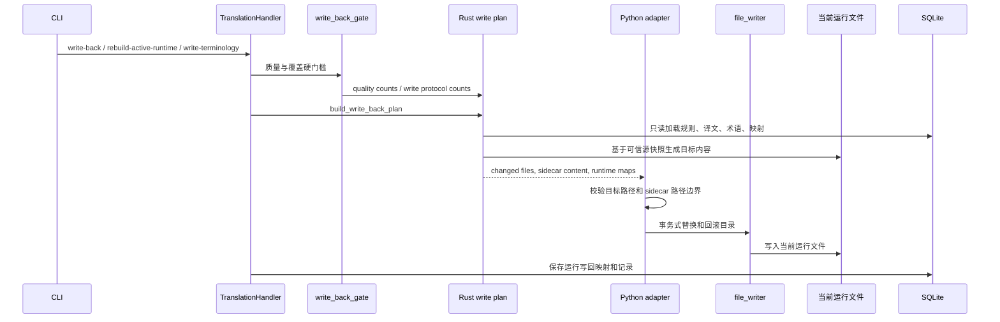

# A.T.T MZ 系统地图（超重型破坏性重构前）

生成日期：2026-06-03

本文是超重型破坏性重构前的准备产物之一。它描述当前系统的业务边界、模块分层、主流程、事实来源、外部契约、性能敏感点和重构风险点。本文不是重构方案，也不替代 `skills/att-mz/` 或 `skills/att-mz-release/` 中的翻译流程契约。

## 1. 系统定位

A.T.T MZ 是一个面向 RPG Maker MV/MZ 游戏汉化流程的 Python CLI 工具，核心业务链路是：

```text
干净游戏目录
-> 注册并创建可信源快照
-> 导出工作区候选和规则草稿
-> 导入并审查文本规则、占位符规则、术语规则
-> 构建当前可翻译文本范围
-> 调用模型翻译并保存已验证译文记录
-> 运行质量检查和写文件前检查
-> 从可信源快照、规则和已保存译文记录生成当前运行游戏文件
-> 根据试玩反馈继续补漏
```

系统最重要的边界是：

| 边界 | 当前含义 | 重构时不能破坏的点 |
| --- | --- | --- |
| 可信源快照 | 注册游戏时创建的 `data_origin`、`js/plugins_origin.js`、`js/plugins_source_origin` | 正文翻译和普通写回都应以可信源快照为来源，不把当前运行文件当源文事实来源 |
| 当前运行文件 | 游戏实际运行的 `data`、`js/plugins.js`、`js/plugins` | 它是写入目标和运行状态审计对象；损坏时应重建或诊断，不能按当前行号猜译文记录 |
| SQLite 游戏库 | 每个游戏一套数据库，保存元数据、规则、术语、译文、文本索引、运行记录和写回映射 | schema 版本必须精确匹配；旧库不自动迁移，不静默兼容 |
| 工作区 JSON | Agent/用户处理候选、规则、手动译文和修复表的临时文件 | 工作区是外部协作载体，不是内部事实来源；导入后才成为数据库事实 |
| LLM 输出 | 模型返回的批量译文 JSON | 模型输出永远不可信，必须经过 ID、行数、结构、占位符和源文残留等校验后才能保存 |
| Rust 原生能力 | CPU 密集扫描、JS AST、写回协议和写回计划 | Python 负责编排和路径安全校验，Rust 负责重型计算；跨语言 JSON 契约必须稳定 |
| Skill 契约 | 开发版和发行版 Agent 翻译流程 | Skill 是 Agent 执行流程，不是普通开发文档；docs 不能覆盖 Skill |
| 发行包 | GitHub Actions release 工作流构建的 Windows ZIP | 本机不能作为正式发行构建和验收环境 |

## 2. 总体架构图



## 3. 入口与命令地图

CLI 入口链路：

```text
main.py
-> app.cli_main.main()
-> app.cli.parser.build_parser()
-> app.cli.dispatch.dispatch_command()
-> app.cli.commands.*
-> app.cli.runtime.HandlerSession
-> TranslationHandler 或 AgentToolkitService
```

命令契约的当前事实来源：

| 层级 | 文件 | 责任 |
| --- | --- | --- |
| 安装入口 | `pyproject.toml` | `att-mz = app.cli_main:main` |
| 开发入口 | `main.py` | 以源码方式运行 CLI |
| 参数定义 | `app/cli/parser.py` | 子命令、参数、默认值、帮助文本 |
| 分发定义 | `app/cli/dispatch.py` | 命令名到 handler 的映射 |
| 命令实现 | `app/cli/commands/*.py` | 将 CLI 参数转换为应用服务调用和 Agent JSON 报告 |
| 会话胶水 | `app/cli/runtime.py` | 装载配置、解析目标游戏、构造 `TranslationHandler` |
| 报告渲染 | `app/cli/reports.py`、`app/agent_toolkit/reports.py` | CLI stdout JSON 结构和错误/警告归一 |

命令族地图：

| 命令族 | 代表命令 | 后端服务 | 关键外部契约 |
| --- | --- | --- | --- |
| 基础状态 | `list`、`doctor`、`probe-source-language` | `GameRegistry`、`AgentToolkitService`、语言探测 | stdout Agent JSON、配置路径、游戏注册状态 |
| 游戏注册 | `add-game`、`reset-game` | `TranslationHandler`、`GameRegistry`、RMMZ loader | 可信源快照、SQLite schema、危险重置边界 |
| 工作区 | `prepare-agent-workspace`、`validate-agent-workspace`、`cleanup-agent-workspace` | `AgentToolkitService` workspace mixin | 工作区 JSON 文件名、结构、UTF-8、清理清单 |
| 插件参数规则 | `export-plugin-rules`、`validate-plugin-rules`、`import-plugin-rules` | `app.plugin_text`、规则记录 | 插件参数路径语法、空规则语义、导入确认 |
| 插件源码规则 | `scan-plugin-source-text`、`export-plugin-source-ast-map`、`validate-plugin-source-rules`、`import-plugin-source-rules` | `app.plugin_source_text`、Rust JS AST | selector 稳定性、风险报告、运行写回映射 |
| 事件指令规则 | `export-event-command-rules`、`validate-event-command-rules`、`import-event-command-rules` | `app.event_command_text` | MV/MZ 指令编码、参数路径、规则组 |
| Note 规则 | `export-note-tag-rules`、`validate-note-tag-rules`、`import-note-tag-rules` | `app.note_tag_text`、Rust note scan | data 文件匹配、标签名精确匹配 |
| 非标准 data 规则 | `export-nonstandard-data-rules`、`validate-nonstandard-data-rules`、`import-nonstandard-data-rules` | `app.nonstandard_data` | 高风险支线、工作区只读源副本、候选归类 |
| 占位符与源文保留 | `export-placeholder-rules`、`import-placeholder-rules`、`import-source-residual-rules` | `app.placeholder_*`、`app.source_residual` | 占位符保护、结构化占位符、源文残留例外 |
| 术语 | `export-terminology`、`import-terminology`、`write-terminology` | `app.terminology`、Rust write plan | 字段译名表、正文术语表、术语专用写入门槛 |
| 文本范围和索引 | `text-scope`、`rebuild-text-index`、`audit-coverage` | `TextScopeService`、`app.text_index` | active/writable 范围、warm index、覆盖报告 |
| 翻译 | `translate`、`translation-status` | `TextTranslation`、`TranslationHandler` | prompt 隔离、批次协议、已保存译文记录 |
| 手动修复 | `export-pending-translations`、`import-manual-translations`、`export-quality-fix-template`、`import-quality-fix`、`reset-translations`、`verify-feedback-text` | `AgentToolkitService` manual/feedback/quality mixins | `translation_lines`、`location_path`、重置清单 |
| 质量和运行审计 | `quality-report`、`audit-active-runtime`、`diagnose-active-runtime` | `AgentToolkitService` quality mixin、Rust quality/write protocol | 写回前检查、当前运行插件源码诊断 |
| 写入 | `write-back`、`rebuild-active-runtime`、`restore-font` | `TranslationHandler`、Rust write plan、`file_writer` | 用户授权、质量硬门槛、路径安全、回滚目录 |
| 总流程 | `run-all` | CLI 命令编排 | 阶段顺序、失败停止、报告汇总 |

## 4. 分层模块地图

| 分层 | 主要文件/目录 | 责任 | 主要依赖 | 重构注意点 |
| --- | --- | --- | --- | --- |
| CLI 与报告 | `app/cli_main.py`、`app/cli/` | 参数、分发、CLI JSON、异常摘要 | 配置、应用服务、AgentToolkit | parser 与 dispatch 必须保持一致；stdout JSON 是外部契约 |
| 配置与运行目录 | `app/config/`、`app/runtime_paths.py`、`app/utils/config_loader_utils.py` | app home、setting、env override、prompt 注入、pydantic 校验 | prompt 文件、Rust regex 校验 | 参数要全链路生效；不能把本机路径写入文档示例 |
| 日志 | `app/observability/logging.py` | loguru 初始化、stderr 摘要、文件日志 | runtime paths | 终端给中文摘要，traceback 写日志 |
| 应用编排 | `app/application/handler.py`、`flow_gate.py`、`write_back_gate.py`、`file_writer.py` | 注册、规则、翻译、写回、术语写入、硬门槛 | 文本域、DB、Rust、LLM | `TranslationHandler` 是最大重构热点；先拆事实来源再拆方法 |
| Agent 工具服务 | `app/agent_toolkit/service.py`、`app/agent_toolkit/services/` | 工作区、覆盖、质量、反馈、手动译文、规则校验 | TextScope、DB、Rust、workspace JSON | `services/common.py` 和 `services/quality.py` 承担过多共享职责 |
| RPG Maker 数据层 | `app/rmmz/` | 游戏结构、标准 JSON 读取、引擎检测、标准文本提取 | aiofiles、demjson3、schema | `GameFileView` 区分可信源和当前运行，不能混用 |
| 文本域规则 | `app/plugin_text/`、`app/plugin_source_text/`、`app/event_command_text/`、`app/note_tag_text/`、`app/nonstandard_data/`、`app/source_residual/` | 各类可见文本发现、规则校验、规则导入、写回定位 | RMMZ、DB、Rust JS AST、TextScope | 每个域都要明确“发现候选、进入翻译、可写回、排除”四件事 |
| 文本范围与索引 | `app/text_scope/`、`app/text_index/` | 汇总当前规则范围、写回探针、warm index、失效判断 | 文本域、DB、Rust write protocol | 性能敏感；避免同命令重复全量扫描 |
| 翻译与验证 | `app/translation/`、`app/llm/`、`app/llm_request_body_extra.py` | 批次构造、模型请求、响应解析、译文校验、队列调度 | LLMHandler、术语、占位符、DB | prompt 不能泄露内部路径/字段；模型结果必须先验证 |
| 术语 | `app/terminology/` | 字段译名表、正文术语表、语境导出、prompt 命中索引 | RMMZ、DB、TextScope、Rust write plan | 字段写回和正文 prompt 术语是两类事实 |
| 持久化 | `app/persistence/` | 游戏注册表、每游戏 SQLite、记录 mixin、schema 检查 | aiosqlite、runtime paths | schema 精确校验；不自动迁移；表结构是外部契约 |
| Rust 适配 | `app/native_quality.py`、`app/native_javascript_ast.py`、`app/native_write_plan.py` | Python 到 `app._native` 的契约适配和路径安全校验 | PyO3 模块、JSON payload | 适配层负责 contract version 和路径边界 |
| Rust 原生核心 | `rust/src/` | 质量扫描、写回协议、JS AST、字体扫描、写回计划 | rayon、rusqlite、tree-sitter-javascript、serde | CPU 重活在 Rust；线程数通过 `ATT_MZ_RUST_THREADS` 限制 |
| Prompt | `prompts/` | system prompt 和输出协议模板 | config loader | 修改 prompt 组装必须测最终 user prompt 的内部信息隔离 |
| Skill 与发行 | `skills/`、`scripts/build_release.py`、`.github/workflows/` | 开发版/发行版流程、发行包构建、冒烟测试 | CLI、docs、prompts、字体 | docs 不能倒置为 Agent 契约；正式发行只走 GitHub Actions |
| 测试 | `tests/`、Rust tests | CLI、文本域、Prompt、Skill、DB、Rust、写回流程 | uv、pytest、cargo | 重构前先建立关键流程金丝雀测试和性能回归测试 |

## 5. 事实来源矩阵

| 事实 | 单一事实来源 | 主要消费者 | 重构风险 |
| --- | --- | --- | --- |
| app home | `app/runtime_paths.py` | 配置加载、日志、DB、发行版运行 | 不能假设源码根目录存在 `setting.toml` |
| CLI 命令和参数 | `app/cli/parser.py` | 用户、Skill、测试、发行版帮助 | dispatch、Skill、README 与 parser 漂移会直接破坏外部流程 |
| 命令到 handler 映射 | `app/cli/dispatch.py` | CLI main、测试 | parser 有命令但 dispatch 无 handler 会造成假入口 |
| CLI stdout 报告 | `app/cli/reports.py`、`app/agent_toolkit/reports.py` | Agent、用户、Skill | stdout 默认最终 JSON；stderr 进度不能当结果 |
| 配置 schema | `app/config/schemas.py` | `load_setting()`、CLI runtime、LLM、写回 | 参数定义后必须解析、校验、应用、测试全链路 |
| LLM system prompt 文本 | `prompts/` 经 `load_setting()` 注入 | `TextTranslation` | prompt 不得包含内部字段、数据库表、真实路径、`location_path` |
| 游戏注册记录 | `GameRegistry` 与每游戏 DB | list、target game session、CLI runtime | 标题/路径/DB 对应关系不能隐式复制 |
| DB schema | `app/persistence/sql.py`、`ensure_schema_compatible()` | 所有 DB session mixin、Rust write plan | schema version 当前为精确契约；旧库不自动迁就 |
| 可信源快照 | 注册流程写入的 `data_origin`、`plugins_origin.js`、`plugins_source_origin` | RMMZ loader、TextScope、Rust write plan | 当前运行文件不能取代可信源快照 |
| 当前运行文件 | `data`、`js/plugins.js`、`js/plugins` | write-back、active-runtime audit、diagnose | 只能作为写入/诊断对象，不能作为源文事实 |
| 当前可翻译范围 | `TextScopeService.build()` | translate、coverage、quality、status、text-index | active 与 writable 不是同义词；不能用规则命中数代替翻译范围 |
| warm text index | `app/text_index/` 的 meta/items/invalidations | 大型游戏质量、状态、小批翻译 | 源文件或规则变化必须失效；不能继续用旧索引 |
| 规则审查状态 | `rule_review_states` | `flow_gate.py`、工作区准备和导入 | 空规则也有确认语义；不能把空文件等同未审查 |
| 已保存译文 | `translation_items` | quality、write-back、status、manual export | 只有验证后保存的译文可参与写回 |
| 翻译运行记录 | `translation_runs`、`llm_failures`、`translation_quality_errors` | status、quality、write-back gate | 质量失败和模型失败影响写回硬门槛 |
| 写入可行性 | Rust write protocol 与 `TextScopeService` write probe | audit-coverage、quality-report、write gate | 可翻译不代表可写回；写回协议错误是硬门槛 |
| 写回计划 | `app.native_write_plan.NativeWritePlanAdapter` + Rust `build_write_back_plan` | write-back、rebuild-active-runtime、write-terminology | Python 必须校验返回路径不越界 |
| 插件源码 selector 写回映射 | `plugin_source_runtime_write_map` | active-runtime audit、diagnose、reset decisions | 没有映射时禁止按当前 JS 行号反推译文 |
| 字段译名表 | `terminology_field_terms` | write-terminology、write-back plan | 字段写回和正文术语提示不能混为一谈 |
| 正文术语表 | `text_glossary_terms` 与 prompt index | prompt batch 构造 | 只影响模型提示，不直接写字段 |
| 发行版 Skill | `skills/att-mz-release/` 经 `scripts/build_release.py` 转换 | 发行包内 Agent 流程 | 发行版不能要求 Python/Rust/源码上下文 |
| 开发版 Skill | `skills/att-mz/` | 源码仓库内翻译流程 | 翻译流程 Skill 不参与普通源码开发和重构 |

## 6. 文本域地图

文本域入口统一汇入 `TextScopeService`，再进入翻译、质量、覆盖和写回链路。每个域都必须明确四个状态：发现候选、进入翻译、已审查排除、可写回。

| 文本域 | 来源视图 | 发现/抽取模块 | 规则来源 | 写回能力 | 主要风险 |
| --- | --- | --- | --- | --- | --- |
| 标准 data 文本 | `data_origin/*.json` | `app.rmmz.extraction.DataTextExtraction` | 内置标准字段和文本规则 | Rust write plan 写回 `data/*.json` | 标准事件文本、数据库字段、地图名之间语义不同 |
| 对话与事件正文 | Map/CommonEvents/Troops 的事件指令 | `DataTextExtraction` 处理 `101`、`401`、`102`、`405` 等 | 内置规则、MV 虚拟名字框规则 | Rust write plan | MV 虚拟名字框和 MZ 标准名字框不能混淆 |
| 插件参数文本 | `js/plugins_origin.js` | `app.plugin_text` | `plugin_text_rules` | Rust write plan 写回 `js/plugins.js` | JSON 叶子路径、资源名、脚本片段容易误翻 |
| 插件源码文本 | `js/plugins_source_origin/*.js` | `app.plugin_source_text` + Rust JS AST | `plugin_source_text_rules` | Rust write plan 写回 `js/plugins/*.js`，并记录 runtime map | selector 必须来自 AST；当前运行文件不能作为 selector 来源 |
| 事件指令参数文本 | 标准 data 事件指令参数 | `app.event_command_text` | 事件指令规则组/过滤器/路径 | Rust write plan | MV `356` 与 MZ `357` 结构不同，不能整块翻译 |
| Note 标签文本 | 标准 data `note` 字段 | `app.note_tag_text` + Rust note scan | `note_tag_text_rules` | Rust write plan | 标签名要精确；脚本、公式、资源引用必须排除 |
| 非标准 data 文本 | 可信源 `data_origin` 中非标准 JSON | `app.nonstandard_data` | `nonstandard_data_text_rules` | Rust write plan | 高风险支线；候选必须归类，不把看不懂结构当无内容 |
| 源文保留例外 | 质量报告提示的残留片段 | `app.source_residual` | `source_residual_rules` | 不写文本，只影响质量判断 | 不能用例外掩盖整句漏翻 |
| 字体替换 | 当前运行/源文件中的字体引用 | `font_replacement` + Rust font scan | 字体替换记录和用户授权 | `restore-font` 或写入流程 | 普通写回不默认覆盖字体 |

`TextSourceType` 当前覆盖 `standard_data`、`plugin_parameter`、`plugin_source`、`event_command`、`note_tag`、`nonstandard_data`。`TextScopeEntry` 同时描述 `enters_translation`、`can_save_translation`、`can_write_back`、`translated` 和不能处理原因；重构时不要把这些字段压扁成单个“是否可用”布尔值。

## 7. 主流程地图

### 7.1 注册游戏



注册流程的关键约束：

- 首次注册必须面向干净游戏目录；已存在可信源快照的目录不应被当成新源继续覆盖。
- 注册后，可信源快照是后续正文翻译和写回计划的源文事实。
- DB schema 必须与当前代码精确兼容；不兼容时显式失败，提示重建或重新注册。

### 7.2 准备工作区与规则导入

```text
prepare-agent-workspace
-> 从可信源快照和当前规则导出候选
-> 生成 manifest、术语上下文、插件/事件/Note/非标准 data/占位符候选
-> 用户或 Agent 编辑规则草稿
-> validate-* 检查格式、路径、候选命中和空规则语义
-> import-* 写入数据库规则表和审查状态
```

这一流程由 `AgentToolkitService` 的 workspace、rule validation、placeholder、terminology 等 mixin 承担。工作区中的文件只有经过对应 `import-*` 后才成为系统事实来源；候选任务包和外部 Agent 输出都只是候选。

### 7.3 文本范围与 warm index

```text
TextScopeService.build()
-> 读取游戏数据、已保存译文和所有规则
-> 汇总标准 data、插件参数、插件源码、事件指令、Note、非标准 data
-> 标记 active / writable / translated / cannot_process_reason
-> 可选运行 write probe
-> rebuild-text-index 持久化索引和失效指纹
```

warm index 的目的不是改变业务语义，而是避免大型游戏在质量报告、状态刷新和小批翻译中反复全量扫描。重构时必须保留：

- 源文件快照变化会让索引失效。
- 文本规则、占位符规则、术语相关审查状态等变化会让索引失效。
- 索引条目数量与当前范围不一致时不能继续信任旧索引。
- 同一命令内不应重复构建文本范围或重复扫描候选，除非有清晰不可复用原因。

### 7.4 翻译



翻译流程关键点：

- `flow_gate.py` 是正文翻译前的规则和审查硬门槛。
- prompt 只给模型当前批次文本、输出格式、术语表和保留约束。
- 内部路径、数据库表、真实文件路径、`location_path`、`translated_text` 等实现信息不得进入 user prompt。
- 程序本地用临时 batch ID 绑定模型输出和 `location_path`；模型不应看到内部定位路径。
- 校验通过的译文进入 `translation_items`；模型失败或质量失败分别进入运行失败记录。

### 7.5 质量、覆盖与状态

```text
quality-report / translation-status / audit-coverage
-> 尽量使用 warm index
-> 检查当前规则范围内的译文覆盖
-> 调用 Rust quality / write protocol count
-> 汇总 warning 和 error
-> 输出 Agent JSON 或文件报告
```

质量与覆盖不是纯展示功能，它们决定能否继续写进游戏文件。当前主要硬门槛包括：

- 当前规则范围内正文译文是否完整。
- 最近一次翻译运行是否仍有质量失败或模型失败。
- 已保存译文是否存在占位符、行宽、结构、源文残留等质量问题。
- 文本是否有可写回协议问题。
- 外部规则、占位符规则、术语表和高风险支线是否已经审查。

### 7.6 写进游戏文件、重建当前运行文件、写术语



写入流程关键点：

- 普通 `write-back` 必须有用户授权，并通过写文件前检查。
- `rebuild-active-runtime` 用于从可信源快照和已保存译文记录重建当前运行文件，不是绕过质量门槛。
- `write-terminology` 是术语专用写入，但仍要通过术语、规则、可信源、写入目标和已保存译文质量检查。
- Rust 负责生成写回计划；Python 适配层负责校验返回路径必须在允许目录内。
- `file_writer` 做事务式替换，出现失败时需要能回滚或明确失败。

### 7.7 试玩反馈与手动修复

```text
verify-feedback-text
-> export-quality-fix-template / export-pending-translations / reset-translations
-> 用户或 Agent 修改 translation_lines
-> import-quality-fix / import-manual-translations
-> quality-report
-> write-back 或 rebuild-active-runtime
```

反馈流程的事实来源仍然是数据库中的已保存译文记录和当前规则范围。当前运行文件中的残留、坏控制符或语法错误只能通过 `audit-active-runtime` 和 `diagnose-active-runtime` 定位；插件源码问题必须依靠写回映射精确反推，不能按当前 JS 文本位置猜测。

## 8. 数据库地图

每个游戏一套 SQLite 数据库。`ensure_schema_compatible()` 对表、列、外键、索引和 schema version 做精确检查；当前设计没有自动迁移路径。

| 表组 | 代表表 | 责任 | 主要写入者 |
| --- | --- | --- | --- |
| schema 与元数据 | `schema_version`、`metadata`、`language_settings` | 标识 DB 版本、游戏信息、语言配置 | 注册流程、配置更新 |
| 源快照 | `source_snapshot_files` | 记录可信源快照文件指纹 | 注册流程、源快照检查 |
| 译文与运行 | `translation_items`、`translation_runs`、`llm_failures`、`translation_quality_errors` | 已保存译文、模型运行、失败记录 | 翻译流程、手动导入、质量流程 |
| 文本索引 | `text_index_meta`、`text_index_items`、`text_index_invalidations` | warm index、失效原因、范围缓存 | `rebuild-text-index`、状态/质量流程 |
| 插件参数规则 | `plugin_text_rules` | 插件配置路径规则 | 规则导入 |
| 插件源码规则与运行映射 | `plugin_source_text_rules`、`plugin_source_runtime_write_map`、`plugin_source_runtime_scan_cache` | AST selector 规则、写回映射、运行扫描缓存 | 插件源码规则导入、写回计划、审计 |
| 事件指令规则 | `event_command_text_rule_groups`、`event_command_text_rule_filters`、`event_command_text_rule_paths` | MV/MZ 事件指令参数规则 | 规则导入 |
| Note 规则 | `note_tag_text_rules` | note 标签文本规则 | 规则导入 |
| 非标准 data 规则 | `nonstandard_data_text_rules` | 非标准 data 文本候选归类 | 规则导入 |
| 占位符规则 | `placeholder_rules`、`structured_placeholder_rules`、`structured_placeholder_rule_groups` | 普通和结构化占位符 | 占位符导入 |
| 源文保留例外 | `source_residual_rules` | 质量扫描中允许保留的源文片段 | 例外导入 |
| MV 名字框 | `mv_virtual_namebox_rules` | MV 虚拟名字框识别 | 规则导入 |
| 规则审查状态 | `rule_review_states` | 空规则、风险候选和支线审查状态 | 规则导入、工作区准备 |
| 术语 | `terminology_field_terms`、`text_glossary_terms`、`terminology_bundle_state` | 字段译名表、正文术语表、术语包状态 | 术语导入、写术语 |
| 字体 | `font_replacement_records` | 字体替换记录 | 字体扫描和恢复 |

重构前必须先决定：

- 哪些表继续作为外部契约保留。
- 哪些表可以随破坏性重构删除并要求重新注册。
- schema 变更是显式失败、重建 DB，还是提供集中迁移；当前项目规范倾向不隐式迁就旧库。

## 9. Rust/Python 边界地图

Python 侧适配层：

| 文件 | 责任 |
| --- | --- |
| `app/native_quality.py` | 调用质量扫描、写回协议、Note 扫描、字体扫描；检查 native contract version |
| `app/native_javascript_ast.py` | 调用 JS 字符串 AST span 扫描和批量扫描 |
| `app/native_write_plan.py` | 调用 Rust 写回计划；校验目标路径、sidecar 内容路径和返回结构 |

Rust 暴露能力：

| Rust/PyO3 函数 | 主要用途 | 性能/安全含义 |
| --- | --- | --- |
| `native_contract_version` | 跨语言契约版本 | Python 必须拒绝不兼容版本 |
| `native_thread_count` | 当前 Rust 线程配置 | 线程数受环境或配置约束，不能无上限抢占 CPU |
| `scan_quality`、`scan_quality_counts` | 译文质量扫描 | 大批量文本检查放 Rust |
| `scan_write_protocol`、`scan_write_protocol_count` | 写回协议检查 | `can_write_back` 与质量硬门槛依赖它 |
| `validate_regex_contract` | 正则契约校验 | 配置/规则导入前置 |
| `collect_note_tag_sources` | Note 标签候选扫描 | 避免 Python 大规模扫描 |
| `scan_font_replacements` | 字体替换扫描 | 运行写入相关 |
| `parse_javascript_string_spans`、`parse_javascript_string_spans_batch` | JS AST 字符串 selector | 插件源码规则和运行审计依赖 |
| `build_write_back_plan` | 构建写回/重建/术语写入计划 | 最重的跨语言业务核心 |

Rust 侧的结果不能直接写文件；必须回到 Python 适配层做路径边界校验，再交给 `file_writer`。这条边界是写回安全的关键。

## 10. 配置、Prompt 与模型地图

配置链路：

```text
ATT_MZ_HOME / 发行版目录 / 源码根目录
-> setting.toml 或 setting.example.toml
-> app.config.schemas pydantic 校验
-> language profile 应用
-> CLI override 和环境变量 override
-> prompt 文件注入与输出协议渲染
-> runtime setting 供 LLM、翻译上下文和写回使用
```

模型调用链路：

```text
TranslationData
-> iter_translation_context_batches()
-> 临时 batch ID 与术语命中
-> LLMHandler OpenAI-compatible request
-> JSON / repaired JSON 解析
-> verify_translation_batch()
-> 保存译文或保存失败
```

Prompt 边界：

- 正文翻译 prompt 只包含当前任务必需的可见文本、输出格式、质量要求、术语和原样保留约束。
- 术语表在 prompt 中使用 `[[术语表]]`，条目是 `原文 => 标准译名`。
- 模型不应看到来源文件名、数据库表名、内部字段名、真实路径、`location_path`、`translated_text`。
- 修改 prompt 组装逻辑后，必须用测试断言最终 user prompt 不泄露内部信息。

## 11. Skill、docs 与发行地图

```text
源码仓库
├─ docs/
│  └─ 人类说明、开发说明、设计说明、排障说明、重构准备文档
├─ skills/att-mz/
│  └─ 开发版 Agent 翻译流程契约，命令入口为 uv run python main.py
├─ skills/att-mz-release/
│  └─ 发行版 Agent 翻译流程契约，命令入口为 .\att-mz.exe
└─ scripts/build_release.py
   └─ 在 GitHub Actions 中把发行版 Skill 转成发行包内 skills/att-mz/SKILL.md
```

关键约束：

- `docs/` 只能放给人类阅读的说明，不作为 Agent 复制、派发、执行、校验的黑盒流程契约。
- 开发版 Skill 和发行版 Skill 只描述翻译流程；普通源码开发、测试修复、重构和发布维护不走翻译流程 Skill。
- 修改 Skill、README、docs 或发布脚本时，要同步检查另一份 Skill 是否发生语义漂移。
- 正式发行包只由 GitHub Actions `release` 工作流构建；发行包不包含源码、测试、历史日志和源码数据库。
- `scripts/build_release.py` 会把 `skills/att-mz-release/SKILL.md` 转换为发行包内 `skills/att-mz/SKILL.md`，并复制发行版 references。

## 12. 外部契约地图

| 契约 | 当前来源 | 受影响对象 | 重构保护方式 |
| --- | --- | --- | --- |
| CLI 子命令和参数 | `app/cli/parser.py` | 用户、Skill、发行包、测试 | parser/dispatch 对齐测试；Skill 命令审查 |
| CLI stdout JSON | `app/cli/reports.py`、`app/agent_toolkit/reports.py` | Agent 自动流程 | 报告字段和错误语义测试 |
| 工作区文件结构 | `skills/*/references/workspace-schema.md`、AgentToolkit workspace 输出 | 用户、子代理、导入命令 | 准备/验证/导入闭环测试 |
| 数据库 schema | `app/persistence/sql.py` | 已注册游戏 | schema 精确检查；破坏性变更显式失败 |
| 配置字段和环境变量 | `setting.example.toml`、`app/config/schemas.py`、`load_setting()` | 开发版、发行版、CI | 定义、解析、校验、应用、测试全链路 |
| Prompt 隐私边界 | `prompts/`、`app/translation/context.py` | LLM 请求 | 最终 user prompt 文本测试 |
| 文本定位路径 | `location_path` 生成与各文本域 | 手动修复、质量报告、写回映射 | 不随意改定位协议；需要改时提供重置或迁移决策 |
| 插件源码 selector | Rust JS AST + `plugin_source_text` | 插件源码规则、运行诊断 | selector 原样复制和校验；禁止手写偏移 |
| Rust native JSON payload | Python adapter + Rust serde structs | 质量、写回、AST、字体 | contract version 和 schema 测试 |
| 发行包布局 | `scripts/build_release.py`、GitHub Actions | 用户、发行版 Skill | release 工作流冒烟测试 |
| 日志语义 | `app/observability/logging.py` | 用户排障、CI 日志 | stderr 摘要和文件 traceback 分层 |

## 13. 性能敏感地图

性能敏感路径：

| 路径 | 为什么敏感 | 当前机制 | 重构风险 |
| --- | --- | --- | --- |
| `TextScopeService.build()` | 会遍历游戏全部文本、插件配置、插件源码、规则和译文 | 汇总所有文本域，可选 write probe | 同命令重复构建会在大游戏上严重退化 |
| `rebuild-text-index` | cold rebuild 是全量扫描 | 持久化源快照和规则指纹 | 指纹不全会导致旧索引被错误复用 |
| `quality-report` | 会检查大量已保存译文和写回协议 | 优先使用 warm index，Rust count 扫描 | 回退到重复 Python 扫描会破坏吞吐 |
| 插件源码 AST | 大量 JS 文件字符串扫描 | Rust `tree-sitter-javascript` + batch API | selector 生成不稳定会破坏规则和诊断 |
| 写回计划 | 读取 DB、源文件、规则、译文并生成变更文件 | Rust `build_write_back_plan` | Python 重新做同类重型扫描会制造双事实来源 |
| 文件写入 | 多文件替换，失败需回滚 | `file_writer` 事务式替换 | 路径校验和回滚边界不能分散 |

重构性能底线：

- 遍历全部游戏文本、插件源码、AST、数据库译文记录或写回计划的流程，必须先梳理本命令内全量扫描次数。
- 同一命令内的覆盖报告、质量报告、写回协议检查和审计阶段应复用已加载的 `GameData`、文本范围、候选扫描结果或 warm index。
- CPU 密集路径优先保留或迁移到 Rust；Python 只做 I/O 编排、配置校验、结果组装和小规模胶水。
- 并发数量必须真实参与调度，并能通过配置或环境限制。

## 14. 当前重构热点

| 热点 | 当前症状 | 破坏性重构前应先固定的事实 |
| --- | --- | --- |
| `app/application/handler.py` | `TranslationHandler` 同时承担注册、规则、翻译、写回、术语、运行记录和字体逻辑 | 明确哪些方法是 CLI 外部行为，哪些只是内部编排 |
| `app/agent_toolkit/services/common.py` | 大量报告、规则、工作区、质量辅助函数集中在一个文件 | 按“报告模型、规则校验、工作区文件、反馈分类、术语任务”拆分事实来源 |
| `app/agent_toolkit/services/quality.py` | 质量报告、状态、运行审计、重置、修复模板等职责过宽 | 先区分展示报告、写回硬门槛、主动诊断和手动修复 |
| `app/persistence/sql.py` | schema 定义大而集中，所有表都是外部契约候选 | 先做表组所有权矩阵，再决定破坏性删除/重建边界 |
| `TextScopeService` 与 `text_index` | 文本范围构建和 warm index 是性能核心 | 先固定 active/writable/translated/cannot_process_reason 语义 |
| 插件源码链路 | AST selector、规则、写回映射、运行诊断跨 Python/Rust/DB | 先固定 selector 生命周期和没有映射时的停止规则 |
| Rust write plan | 跨 DB、文件、质量、术语和写回协议 | 先固定 Python/Rust payload 和路径安全边界 |
| Skill 与 docs | 开发版/发行版 Skill 语义必须一致，但 docs 不能成为 Agent 契约 | 修改任何一侧前先列出复制关系和发行转换关系 |
| 测试体量 | 多个大测试文件覆盖端到端行为 | 先提炼金丝雀流程测试，避免重构时只靠大文件定位失败 |

## 15. 破坏性重构禁区

以下行为在当前项目规则下会直接制造风险：

- 把当前运行文件当作正文翻译源文，绕过可信源快照。
- 把工作区候选文件或外部 Agent 候选当作已导入规则。
- 为了兼容旧 DB 静默迁移、吞异常或自动猜测新语义。
- 在 prompt 中加入文件名、数据库字段、真实路径、`location_path` 或写回机制解释。
- 在质量检查有 error 时继续写进游戏文件。
- 在没有插件源码写回映射时，按当前 JS 文本、行号、上下文或 AST 顺序猜测译文记录。
- 将 `docs/` 写成 Agent 必须复制执行的任务契约，或声明 docs 覆盖 Skill。
- 本机构建正式发行包并当成发行验收结果。
- 用 Python 重新实现已有 Rust 重型扫描，形成双事实来源。
- 把 `enters_translation`、`can_save_translation`、`can_write_back` 压成单一状态，掩盖可翻译但不可写、可保存但不可写等差异。

## 16. 重构前准备清单

真正开始超重型破坏性重构前，建议先完成以下准备：

| 准备项 | 完成标准 |
| --- | --- |
| CLI 契约冻结 | 列出保留、删除、改名、破坏性变更的命令和参数；同步 Skill 与 README |
| DB 契约冻结 | 按表组确认保留/删除/重建；决定旧库显式失败文案 |
| 文本定位契约冻结 | 明确 `location_path`、plugin source selector、event path、note tag path 是否保留 |
| TextScope 语义冻结 | 固定 active、writable、translated、cannot_process_reason 的外部含义 |
| Prompt 隐私测试 | 对最终 user prompt 做泄露断言，覆盖术语和正文批次 |
| 写回安全测试 | 覆盖路径越界、sidecar 越界、回滚、质量硬门槛 |
| warm index 性能测试 | 覆盖不重复构建文本范围、规则变化失效、源文件变化失效 |
| 发行版 Skill 同步审查 | 确认开发版/发行版 Skill 语义一致，差异只来自命令入口和运行环境 |
| 关键主流程金丝雀 | 注册、准备工作区、导入规则、翻译、质量、写回、反馈修复各有稳定测试 |
| Rust/Python contract 测试 | contract version、payload schema、write plan 返回路径、线程配置均可验证 |
| 用户文案审查 | 用户可见报告按“发生了什么、影响什么、下一步做什么”表达，不泄露内部实现 |

## 17. 后续地图维护规则

- 本地图描述当前系统，不记录历史对比；历史变更应写入 changelog、迁移指南或发布说明。
- 重构期间如果删除、合并或迁移模块，应先更新本地图中的事实来源矩阵和外部契约地图。
- 如果发现本文与 `app/cli/parser.py`、DB schema、Skill references 或发行脚本冲突，应优先相信当前代码和 Skill 契约，再更新本文。
- 本文只作为人类重构准备文档，不作为 Agent 翻译流程执行依据。
